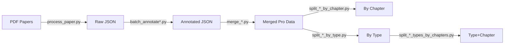

# Bihar 12th PYQs - Question Paper Processing System

A comprehensive Python-based pipeline for downloading, processing, annotating, and organizing Class 12 question papers from Bihar Board (2009–2025).

## 📊 Data Pipeline Overview



---

## 🚀 Quick Start: Processing a New Year

```powershell
# 1. Set API Key (required for Gemini AI)
$env:GOOGLE_API_KEY = "YOUR_API_KEY"

# 2. Download PDFs (if needed)
python pyqs.py

# 3. Extract questions from PDF → JSON
python process_paper.py

# 4. Add chapter/topic annotations
python batch_annotate.py          # For Biology/Chemistry
python batch_annotate_physics.py  # For Physics (includes topics)

# 5. Merge all years into one file
python merge_biology.py
python merge_chemistry.py
python merge_physics.py

# 6. Split by chapter or type
python split_biology_by_chapter.py
python split_biology_by_type.py
```

---

## 📁 Folder Structure

| Folder | Contents |
|--------|----------|
| `{subject}_papers/` | Downloaded PDF question papers |
| `{subject}_data/` | Raw extracted JSON (no annotations) |
| `{subject}_data_annotated/` | JSON with chapter/topic metadata |
| `{subject}_pro/` | Merged file: all years combined |
| `{subject}_pro_chapters/` | Split by chapter |
| `{subject}_pro_types/` | Split by question type |
| `{subject}_pro_type_chapters/` | Split by type, then by chapter |

---

## 📜 Script Reference

### Stage 1: Download & Extract

| Script | Input | Output | Description |
|--------|-------|--------|-------------|
| `pyqs.py` | Bihar Board website | `{subject}_papers/*.pdf` | Downloads PDFs for all years |
| `process_paper.py` | Single PDF (interactive) | `{subject}_data/*.json` | Extracts questions using Gemini AI |
| `batch_processing.py` | `physics_papers/*.pdf` | `physics_data/*.json` | Batch PDF extraction for physics |

### Stage 2: Annotate with Chapters/Topics

| Script | Input | Output | Description |
|--------|-------|--------|-------------|
| `batch_annotate.py` | `{subject}_data/*.json` | `{subject}_data_annotated/*.json` | Adds chapter info (Bio/Chem) |
| `batch_annotate_physics.py` | `physics_data/*.json` | `physics_data_annotated/*.json` | Adds chapter + topic info |
| `annotate_questions_with_chapters.py` | Single file (interactive) | Annotated JSON | Interactive single-file annotator |
| `annotate_questions_with_topics_physics.py` | Single file (interactive) | Annotated JSON | Physics with topics |

### Stage 3: Merge & Organize

| Script | Input | Output | Description |
|--------|-------|--------|-------------|
| `merge_biology.py` | `biology_data_annotated/` | `biology_pro/biology_all_years.json` | Combines all years |
| `merge_chemistry.py` | `chemistry_data_annotated/` | `chemistry_pro/chemistry_all_years.json` | Combines all years |
| `merge_physics.py` | `physics_data_annotated/` | `physics_pro/physics_all_years.json` | Combines all years |

### Stage 4: Split for Analysis

| Script | Input | Output | Description |
|--------|-------|--------|-------------|
| `split_{subject}_by_chapter.py` | `{subject}_pro/` | `{subject}_pro_chapters/` | One file per chapter |
| `split_{subject}_by_type.py` | `{subject}_pro/` | `{subject}_pro_types/` | One file per type (MCQ/Short/Long) |
| `split_{subject}_types_by_chapters.py` | `{subject}_pro_types/` | `{subject}_pro_type_chapters/` | Each type split by chapter |

### Utility Scripts

| Script | Purpose |
|--------|---------|
| `extract_objective_questions.py` | Extract all MCQs from chemistry data |
| `extract_short_questions.py` | Extract all short answers from chemistry |
| `extract_long_questions.py` | Extract all long answers from chemistry |
| `json_to_excel_converter.py` | Convert JSON to Excel format |
| `add_chapter_names_to_annotated.py` | Add chapter names to files with only numbers |
| `reorder_chapter_name.py` | Reorder fields in a single file |
| `reorder_chapter_name_all.py` | Reorder fields in all files in a folder |

---

## 🔧 Prerequisites

```bash
pip install google-generativeai pandas xlsxwriter requests
```

Set your Gemini API key before running annotation scripts:
```powershell
$env:GOOGLE_API_KEY = "your-api-key-here"
```

---

## 📝 JSON Data Structure

```json
{
  "id": "obj_1",
  "type": "objective",
  "chapter": "1",
  "chapter_name": "Electric Charges and Fields",
  "topic": "1.5",
  "topic_name": "Coulomb's Law",
  "question": "English question text with $LaTeX$",
  "prashna": "Hindi question text",
  "options": {"A": "...", "B": "...", "C": "...", "D": "..."},
  "vikalpa": {"A": "...", "B": "...", "C": "...", "D": "..."}
}
```

---

## 🎯 Common Workflows

### Add a new year's paper
1. Place PDF in `{subject}_papers/`
2. Run `python process_paper.py` → select the file
3. Run `python batch_annotate.py` (or `batch_annotate_physics.py`)
4. Run `python merge_{subject}.py`
5. Run split scripts to regenerate organized files

### Export to Excel
```bash
python json_to_excel_converter.py
```

### Get all MCQs for a subject
Check `{subject}_pro_types/type-objective.json`

---

## 📚 Detailed Script Reference

### Download Scripts

#### `pyqs.py`
**Purpose:** Downloads question paper PDFs from Bihar Board's official website.

```powershell
python pyqs.py
```

- **Input:** None (downloads from web)
- **Output:** PDF files in `{subject}_papers/` folders
- **Years:** 2009–2025
- **Subjects:** Biology, Chemistry, Physics, Mathematics

---

### PDF Extraction Scripts

#### `process_paper.py`
**Purpose:** Interactive script to extract questions from a single PDF using Gemini AI.

```powershell
python process_paper.py
```

- **Input:** Select a PDF from the displayed list
- **Output:** `{subject}_data/{filename}.json`
- **Features:**
  - Bilingual extraction (English + Hindi)
  - LaTeX formatting for math/chemistry
  - Automatic translation if one language is missing
- **Requires:** `GOOGLE_API_KEY` environment variable

#### `batch_processing.py`
**Purpose:** Batch version of `process_paper.py` specifically for physics papers.

```powershell
python batch_processing.py
```

- **Input:** All PDFs in `physics_papers/`
- **Output:** `physics_data/*.json`
- **Difference from `process_paper.py`:**
  - Non-interactive (processes all files automatically)
  - Skips already processed files
  - Physics-specific only

---

### Annotation Scripts

#### `batch_annotate.py`
**Purpose:** Adds chapter numbers and names to questions for **Biology** and **Chemistry**.

```powershell
python batch_annotate.py
# Then select: 1. Biology or 2. Chemistry
```

- **Input:** `{subject}_data/*.json`
- **Output:** `{subject}_data_annotated/*.json`
- **Adds:** `chapter`, `chapter_name` fields
- **Skips:** Already annotated files

#### `batch_annotate_physics.py`
**Purpose:** Adds chapter AND topic information to physics questions.

```powershell
python batch_annotate_physics.py
```

- **Input:** `physics_data/*.json`
- **Output:** `physics_data_annotated/*.json`
- **Adds:** `chapter`, `chapter_name`, `topic`, `topic_name` fields
- **Difference from `batch_annotate.py`:**
  - Physics-only (hardcoded)
  - Includes detailed topic breakdown (e.g., "1.5 Coulomb's Law")
  - Non-interactive (no subject selection prompt)

#### `annotate_questions_with_chapters.py`
**Purpose:** Interactive single-file annotator for any subject.

```powershell
python annotate_questions_with_chapters.py
```

- **Use when:** You want to annotate just one specific file
- **Difference:** Interactive file selection, one file at a time

#### `annotate_questions_with_topics_physics.py`
**Purpose:** Interactive single-file annotator for physics with topic-level detail.

```powershell
python annotate_questions_with_topics_physics.py
```

- **Use when:** You want to annotate one physics file with full topic info
- **Difference from `annotate_questions_with_chapters.py`:**
  - Physics-only
  - Adds topic-level metadata

---

### Merge Scripts

#### `merge_biology.py` / `merge_chemistry.py` / `merge_physics.py`
**Purpose:** Combines all year-wise annotated files into a single consolidated file.

```powershell
python merge_biology.py
python merge_chemistry.py
python merge_physics.py
```

- **Input:** `{subject}_data_annotated/` (all JSON files)
- **Output:** `{subject}_pro/{subject}_all_years.json`
- **Output Structure:**
  ```json
  {
    "2009": [...questions...],
    "2010": [...questions...],
    ...
    "2025": [...questions...]
  }
  ```
- **All three scripts are identical** except for folder/file names

---

### Split Scripts

#### `split_{subject}_by_chapter.py`
**Purpose:** Splits the merged file into separate files per chapter.

```powershell
python split_biology_by_chapter.py
python split_chemistry_by_chapter.py
python split_physics_by_chapter.py
```

- **Input:** `{subject}_pro/{subject}_all_years.json`
- **Output:** `{subject}_pro_chapters/chapter-{name}.json` + `manifest.json`
- **Use case:** When you want all questions from a specific chapter across all years

#### `split_{subject}_by_type.py`
**Purpose:** Splits the merged file by question type (objective/short/long).

```powershell
python split_biology_by_type.py
python split_chemistry_by_type.py
python split_physics_by_type.py
```

- **Input:** `{subject}_pro/{subject}_all_years.json`
- **Output:** `{subject}_pro_types/type-{type}.json` + `manifest.json`
- **Files created:**
  - `type-objective.json` (MCQs)
  - `type-short.json` (Short answers)
  - `type-long.json` (Long answers)
- **Use case:** When you want all MCQs or all long-answer questions

#### `split_{subject}_types_by_chapters.py`
**Purpose:** Further splits each type file by chapter.

```powershell
python split_biology_types_by_chapters.py
python split_chemistry_types_by_chapters.py
python split_physics_types_by_chapters.py
```

- **Input:** `{subject}_pro_types/type-{type}.json`
- **Output:** `{subject}_pro_type_chapters/{type}_chapters/chapter-{name}.json`
- **Use case:** When you want "all MCQs from Chapter 5" or "all long answers from Optics"
- **Runs after:** `split_{subject}_by_type.py` (depends on its output)

---

### Extract Scripts

#### `extract_objective_questions.py`
**Purpose:** Extracts all MCQ questions from chemistry data files.

```powershell
python extract_objective_questions.py
```

- **Input:** `chemistry_data_annotated/*.json`
- **Output:** `extracts/objective_questions.json`
- **Chemistry-specific**

#### `extract_short_questions.py`
**Purpose:** Extracts all short answer questions from chemistry data.

```powershell
python extract_short_questions.py
```

- **Input:** `chemistry_data_annotated/*.json`
- **Output:** `extracts/short_questions.json`

#### `extract_long_questions.py`
**Purpose:** Extracts all long answer questions from chemistry data.

```powershell
python extract_long_questions.py
```

- **Input:** `chemistry_data_annotated/*.json`
- **Output:** `extracts/long_questions.json`

> **Note:** These extract scripts are older and work on annotated data directly. The `split_*_by_type.py` scripts provide similar functionality but work on the merged "pro" data.

---

### Utility Scripts

#### `json_to_excel_converter.py`
**Purpose:** Converts JSON question files to Excel format.

```powershell
python json_to_excel_converter.py
```

- **Input:** Select a JSON file interactively
- **Output:** `.xlsx` file in the same location
- **Features:**
  - Auto-adjusts column widths
  - Bilingual columns (English + Hindi)

#### `add_chapter_names_to_annotated.py`
**Purpose:** Adds `chapter_name` field to files that only have `chapter` numbers.

```powershell
python add_chapter_names_to_annotated.py
```

- **Use when:** You have annotated files with chapter numbers but missing names
- **Rarely needed:** Modern annotation scripts add both fields

#### `reorder_chapter_name.py`
**Purpose:** Reorders JSON fields so `chapter_name` appears right after `chapter`.

```powershell
python reorder_chapter_name.py
```

- **Use when:** Field ordering matters for readability
- **Single file operation**

#### `reorder_chapter_name_all.py`
**Purpose:** Batch version of `reorder_chapter_name.py` for entire folders.

```powershell
python reorder_chapter_name_all.py
```

- **Processes all JSON files in a specified folder**

---

## ❓ FAQ

**Q: Which annotation script should I use?**
- For Biology/Chemistry: `batch_annotate.py`
- For Physics: `batch_annotate_physics.py` (includes topics)

**Q: What's the difference between `_data` and `_data_annotated` folders?**
- `_data`: Raw extracted questions (no chapter info)
- `_data_annotated`: Questions with chapter/topic metadata

**Q: I added new papers. What scripts do I run?**
1. `process_paper.py` → Extract from PDF
2. `batch_annotate*.py` → Add chapter info
3. `merge_*.py` → Update consolidated file
4. `split_*.py` → Regenerate organized files

**Q: Why are there separate scripts for each subject?**
- Merge and split scripts are subject-specific to avoid confusion
- They're nearly identical but point to different folders

